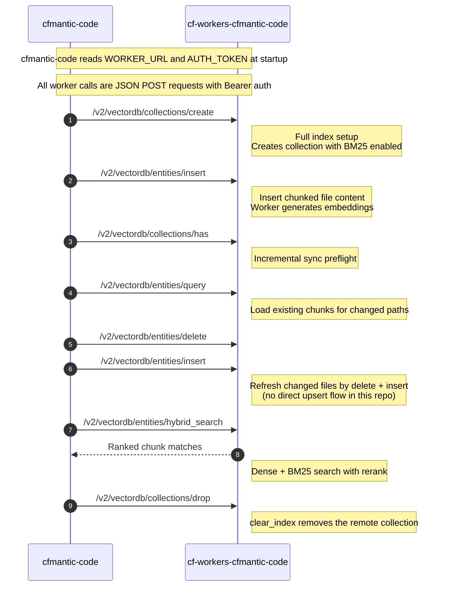

# CFmantic-Code MCP

CFmantic-Code MCP is a Go STDIO MCP server for walking and indexing a local codebase.

Backed by [cf-workers-cfmantic-code companion worker](https://gitlab.com/jarylc/cf-workers-cfmantic-code), ultimately enabling semantic searching a codebase via natural language.

This project started out as Cloudflare-backed "fork" of [claude-context](https://github.com/zilliztech/claude-context) and in Go.

## Features

- Index a local codebase for semantic search
- Search indexed code with natural language queries
- Incrementally re-index changed files (periodically or on-demand)
- Run background sync for tracked paths
- Clear index data for a codebase
- View indexing status and progress
- tree-sitter AST chunk splitting (if language is supported)
- Optional desktop notifications
- .gitignore and .indexignore support

## Samples

- [Go discovery sample](samples/general-discovery-go.md)
- [TypeScript discovery sample](samples/general-discovery-typescript.md)
- [Subdirectory and extension filtering sample](samples/subdirectory-and-extension-filtering.md)


## Prerequisite

- [cf-workers-cfmantic-code companion worker](https://gitlab.com/jarylc/cf-workers-cfmantic-code) deployed.

## Quick Start

1. Download the latest release for your platform from:
   - https://github.com/jarylc/cfmantic-code/releases
2. Extract the archive and note the binary path:
   - `cfmantic-code` on Linux/macOS
   - `cfmantic-code.exe` on Windows
3. Deploy the [cf-workers-cfmantic-code companion worker](https://gitlab.com/jarylc/cf-workers-cfmantic-code) and collect:
   - `WORKER_URL`
   - `AUTH_TOKEN`
4. Point your MCP client at the extracted binary path.

Running from source is still supported for local development, but it requires CGO plus a local C toolchain because the server links official `go-tree-sitter` grammar bindings.

### OpenCode MCP config

Config file: `~/.opencode/config.json` or `opencode.json`

```json
{
   "mcp": {
      "cfmantic-code": {
         "command": "<path-to-cfmantic-code>",
         "env": {
            "WORKER_URL": "https://cfmantic-code.<your-subdomain>.workers.dev",
            "AUTH_TOKEN": "<your-token>",
            "DESKTOP_NOTIFICATIONS": "true"
         },
         "enabled": true
      }
   }
}
```

### Windsurf MCP config

Config file: `~/.codeium/windsurf/mcp_config.json`

```json
{
   "mcpServers": {
      "cfmantic-code": {
         "command": "<path-to-cfmantic-code>",
         "env": {
            "WORKER_URL": "https://cfmantic-code.<your-subdomain>.workers.dev",
            "AUTH_TOKEN": "<your-token>",
            "DESKTOP_NOTIFICATIONS": "true"
         }
      }
   }
}
```

### Claude Code MCP config

Config file: `.mcp.json` or `~/.claude/config.json`

```json
{
   "mcpServers": {
      "cfmantic-code": {
         "command": "<path-to-cfmantic-code>",
         "env": {
            "WORKER_URL": "https://cfmantic-code.<your-subdomain>.workers.dev",
            "AUTH_TOKEN": "<your-token>",
            "DESKTOP_NOTIFICATIONS": "true"
         }
      }
   }
}
```

## Environment Variables

Required:

- `WORKER_URL`: Cloudflare Worker base URL
- `AUTH_TOKEN`: Auth token used to call the worker

Common optional variables:

- `DESKTOP_NOTIFICATIONS`: `true` or `false`, default `false`
- `SYNC_INTERVAL`: seconds between background sync runs, default `60`, set `0` to disable
- `SPLITTER_TYPE`: `ast` or `text`, default `ast`
- `RERANK_STRATEGY`: workers hybrid rerank strategy, must be `workers_ai` or `rrf`, default `workers_ai`
- `CUSTOM_IGNORE_PATTERNS`: comma-separated list of ignore patterns

Advanced optional variables:

- `EMBEDDING_DIMENSION`: embedding size, must be positive, default `1024`
- `CHUNK_SIZE`: chunk size, must be positive, default `8000`
- `CHUNK_OVERLAP`: chunk overlap, must be `>= 0` and `< CHUNK_SIZE`, default `400`
- `INDEX_CONCURRENCY`: indexing worker count, default is your CPU count / 2
- `INSERT_BATCH_SIZE`: entities per insert request, default `192`
- `INSERT_CONCURRENCY`: concurrent insert requests, default `4`

## cf-workers-cfmantic-code interaction overview



## Development

Tagged GitHub releases (`v*`) are built on GitHub runners and published at https://github.com/jarylc/cfmantic-code/releases. `make build` embeds the current git tag/version into the binary.

For local source builds, install:

- Go 1.26+
- A working C toolchain for CGO (`Xcode Command Line Tools` on macOS, `build-essential` or equivalent on Linux, `MSYS2 MinGW-w64` on Windows)

```bash
git clone https://github.com/jarylc/cfmantic-code.git
cd cfmantic-code

export WORKER_URL=http://localhost:8787
export AUTH_TOKEN=your-token

make run
```

`go run .` still works for local development with the same CGO prerequisites.

Useful commands:

- `make build`
- `make run`
- `make test`
- `make lint`
- `make pre-commit`
